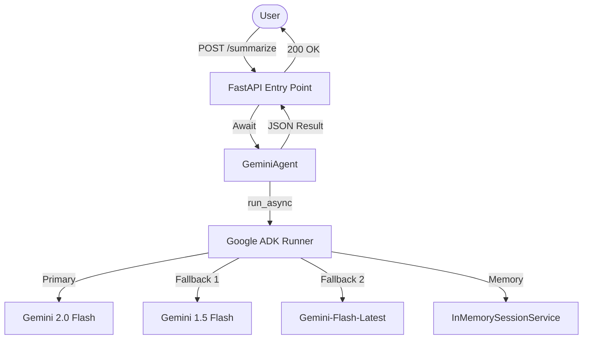

# AI Text Summarization Agent (Google ADK Integrated)

**🔴 Live Service**: [https://summarizer-agent-654230503748.us-central1.run.app/docs](https://summarizer-agent-654230503748.us-central1.run.app/docs)  
**✅ Status**: Deployed and Working (Google Cloud Run)

A production-ready, modularized FastAPI service designed for high-performance text summarization. This project utilizes the **Google Agent Development Kit (ADK)** and the **Gemini 2.0 Flash** model, featuring a robust multi-model fallback system for maximum reliability and quota resilience.

---

## 🏗 Architecture & Design (ADK-Friendly)

This project follows the **Agent Development Kit (ADK)** modular structure, separating API logic from agent execution and tool definitions.



### Key Components
- **`app/main.py`**: The FastAPI application handling routing and async execution.
- **`app/agent.py`**: Core logic leveraging `google.adk.agents.Agent` and `google.adk.Runner`.
- **`app/tools.py`**: Ready-to-use module for extending agent capabilities with custom tools.
- **Multi-Model Fallback**: Automatically cycles through multiple Gemini models to bypass 429 Resource Exhausted errors.

---

## 🚀 Getting Started

### 1. Prerequisites
- Python 3.14+
- Google Gemini API Key ([Get it here](https://aistudio.google.com/))

### 2. Installation
```bash
# Clone the repository
git clone https://github.com/abhi542/Text_Summary_Agent_using_google_ADK.git
cd Text_Summary_Agent_using_google_ADK

# Setup Virtual Environment
python -m venv venv
source venv/bin/activate

# Install Dependencies
pip install -r requirements.txt
```

### 3. Configuration
Create a `.env` file in the root directory:
```env
GEMINI_API_KEY=your_api_key_here
PORT=8080
```

### 4. Running the Service
```bash
python -m app.main
```

---

## 🧪 Testing with Sample Data

### Sample Request
```bash
curl -X POST http://localhost:8080/summarize \
     -H "Content-Type: application/json" \
     -d @sample_request.json
```

### Sample Response
```json
{
  "summary": "The Eiffel Tower is a wrought-iron lattice icon in Paris, France. Named after engineer Gustave Eiffel, it served as the 1889 World's Fair centerpiece. Today, it is recognized globally as a cultural symbol of the French nation.",
  "model": "gemini-flash-latest"
}
```


---

## 🐳 Docker Support
Build and run locally with Docker:
```bash
docker build -t summarizer-agent .
docker run -p 8080:8080 --env-file .env summarizer-agent
```

---

## 🛡 Security & Best Practices
- **Secret Management**: `.env` is ignored by Git to prevent API key leakage. For production, use **Google Secret Manager**.
- **Containerization**: Optimized Dockerfile for deployment to **Google Cloud Run**.
- **Modularity**: ADK-compliant structure ensures easy scalability and tool integration.

---

## 🎞 Demo & Visuals
### Demo Video 
https://github.com/user-attachments/assets/2d5cbe27-aa0f-4a64-9e0f-792788d8ef5a

---

## 📜 Google Certification Notes
This implementation demonstrates:
- Comprehensive use of the **Google GenAI Python SDK**.
- Implementation of **Agent Development Kit (ADK)** patterns (`Runner`, `SessionService`).
- Robust error handling and model fallback strategies.
- Clean, modular, and well-documented Python code.

---

## 🛠 Detailed GCP Deployment Steps (Ref: Project Certification)

For documentation purposes, the following exact steps were taken to deploy this service:

1.  **Project Initialization**: Set up project `sodium-cat-461211-m5` in Google Cloud Console.
2.  **Billing Integration**: Linked the project to a valid Google Billing Account to enable premium AI services.
3.  **API Enablement**: Enabled the following essential Google Cloud APIs via Cloud Shell:
    ```bash
    gcloud services enable artifactregistry.googleapis.com cloudbuild.googleapis.com run.googleapis.com
    ```
4.  **Containerization**: Built the application using **Google Cloud Build** and stored the image in **Artifact Registry**:
    ```bash
    gcloud builds submit --tag gcr.io/sodium-cat-461211-m5/summarizer-agent .
    ```
5.  **Service Deployment**: Deployed to **Google Cloud Run** with serverless scaling and secure environment variables for `GEMINI_API_KEY`:
    ```bash
    gcloud run deploy summarizer-agent \
        --image gcr.io/sodium-cat-461211-m5/summarizer-agent \
        --platform managed \
        --region us-central1 \
        --allow-unauthenticated \
        --set-env-vars GEMINI_API_KEY=[YOUR-KEY]
    ```

---

## 🖥 Where to view in Google Cloud UI

To manage your live service, navigate to these sections in the [GCP Console](https://console.cloud.google.com/):

- **Cloud Run**: Search for "Cloud Run" to see the `summarizer-agent` status, logs, and traffic metrics.
- **Cloud Build**: Search for "Cloud Build" to see the history of your container builds.
- **Artifact Registry**: Search for "Artifact Registry" to see your stored container images.
- **Log Explorer**: Search for "Logs Explorer" to see real-time AI agent execution logs.

---
**Submission Ready**: This repository contains the full source, modular ADK integration, and documented deployment path for final certification.
